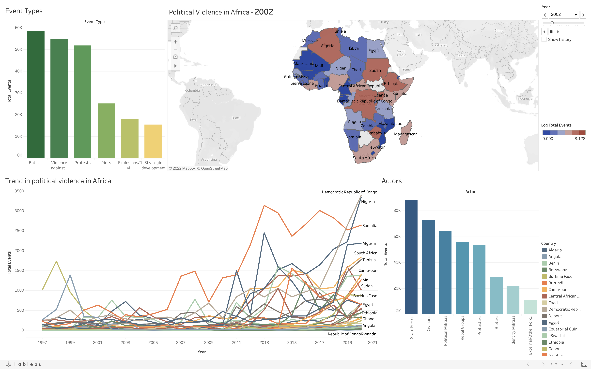

# Data-Visualization-Tableau

This project contains an interactive dashboard made on Tableau using political vilolence data in Africa. The idea is to go from numbers to information to understanding.

Following image is a picture of this dashboard.

At a glance, you can see:

1. Types of political violence in Africa
2. Geographical spread of political violence in africa
3. Trend of political violence in individual countries
4. Actors who perptrate political violence
